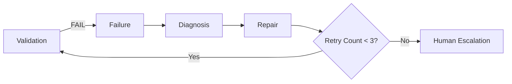

# Repair Loop Notes

## Current state in jcode source

- DAG engine `requeue_failed` lives in `jcode-plan/src/dag/ops.rs`
- `MAX_PLAN_ITEMS = 1024` (node upper bound)
- `MAX_SWARM_MEMBERS = 1000` (member upper bound)
- Retry count is managed inside the DAG, **not exposed as a configuration field**

## Vision from new.md §12

## Implementation path

1. **Short term (hook layer)**: a `jcode-tool-policy` hook records the failure count of `delegate_task`
2. **Mid term (state layer)**: add `Config.repair_max_retries: usize = 3` to the jcode engine
3. **Long term (DAG layer)**: in `requeue_failed`, check the `retry_count` field and escalate when exceeded

## Action items for this repo

- Add `[dag] max_retries = 3` placeholder in `config/profiles/autonomous.toml` (pending jcode engine support)
- For now, substitute via `jcode-tool-policy` (pre_tool gate)