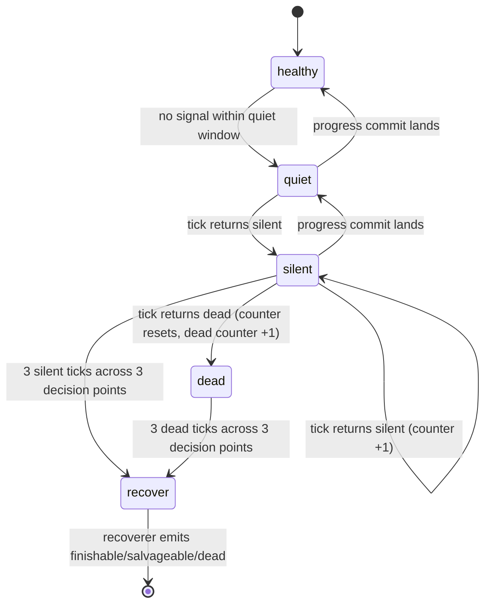

<!--
This file is the framework-level reference for the Smart Postman tick
protocol. It is loaded from `docs/POSTMAN_PROTOCOL.md` after install (the
install symlinks docs/ into ~/.jcode/docs/) and is the authoritative source
when prompt-overlay §1 and swarm-prompt §13 point at "postman protocol".

The protocol's job is to keep root's view of worker state honest without
turning root into a polling daemon. Three constraints drive every choice
below:

  1. LLM sessions have no real-time timer. Any "tick every N minutes"
     rule is aspirational, not enforceable. The protocol must work even
     when root only fires on user / dm / schedule wakeups.

  2. The artifact-as-commit model (docs/HEARTBEAT.md) is the primary
     signal. The script in scripts/swarm-state-monitor.py classifies
     that signal at decision points. Ad-hoc `git log` calls by root are
     the failure mode this protocol replaces.

  3. Three observations gate re-dispatch. Slow workers are normal —
     LLM thinking + long test runs routinely exceed 5 min. The protocol
     must distinguish "still working" from "abandoned" with a budget of
     mistakes, not a hard deadline.
-->

# Smart Postman Protocol

The set of rules root follows to observe worker state, decide on
recovery, and integrate without becoming a polling daemon.

## 1. Inline tick (replaces ad-hoc polling)

The only sanctioned way for root to observe worker state is the
`scripts/swarm-state-monitor.py tick` command (after install, available
globally as `swarm-state-monitor tick`). It is run inline — at decision
points — not on a timer.

**Tick decision points** (run tick on any of these; root is already
awake at all of them):

- A user message arrives.
- A worker handoff arrives (cross-check the handoff against the commit).
- Root finishes a logical chunk of its own work and is about to act.
- Root is about to integrate a worker branch.
- Root is about to spawn a new worker.

Root MUST NOT call `schedule(target=resume, wake_in_minutes=N)` to
"check on workers". LLM sessions have no real-time timer; a forced
self-wakeup would add latency without helping root notice workers any
faster than the worker's own handoff. (See swarm-prompt.md §12 root
obligation 2.)

**Tick output** is a single classification table. For each active worker
branch, the script emits one row:

```
branch                                            class            age  artifact    conf      rationale
feat/postman-tooling_f06d9e6                       healthy          3m  final       high      final commit 3m ago, within quiet window
feat/consistency-fixer_f06d9e6                     quiet            7m  progress    medium    progress commit 7m ago, within quiet window
feat/install-wirer_f06d9e6                        silent          12m  progress    low       progress commit 12m ago, past silent SLA
feat/overlay-refactor_f06d9e6                      dead            32m  —           —         no artifact on commit 32m ago, past dead SLA
```

Class semantics:

| Class        | Meaning                                                        |
|--------------|----------------------------------------------------------------|
| `healthy`    | Recent progress, all signals aligned. No action.               |
| `progressing`| Recent progress, working as expected. No action.               |
| `quiet`      | No new signal within quiet window. Optional `dm` reminder.     |
| `silent`     | No signal past silent SLA. Increment observation counter.      |
| `dead`       | No signal past dead SLA, or final commit without handoff.      |

**Stale branch filtering.** The script defaults to `--since=24` hours;
branches whose latest commit is older are hidden behind an
`(N stale hidden)` note. Use `--include-stale` for the full list. This
prevents ancient zombie branches from drowning real signal.

## 2. Three-observation gate (avoid premature re-dispatch)

LLM workers routinely take 10+ minutes on long tests. A single `silent`
or `dead` observation is **not** enough signal to act. Root MUST observe
the unhealthy classification across **three separate decision points**
before re-dispatching, resetting, or spawning a recoverer.

The gate is not a fixed timer. "Three observations" means three actual
tick calls at three different decision points, separated by root's own
work. If root is busy integrating another branch, that gap counts.



The counter increments are per-branch. A worker that goes silent →
healthy → silent is reset to 0.

## 3. Three recovery actions

Only after the three-observation gate passes does root act:

1. **Continue.** Worker has a specific blocker only root can answer
   (missing decision, missing info, scope ambiguity). Reply via `dm`
   with the concrete next step; worker resumes. Cheapest option; use
   when the work is on track and the blocker is small.

2. **Reset.** Worker is fundamentally stuck — wrong scope, dead-end
   approach, conflicting requirements. `stop` the worker. Spawn a
   fresh worker with corrected scope, optionally prepended with
   `git show <old_branch>:<files>` to preserve useful partial work. Use
   when continuing would waste more tokens than starting fresh.

3. **Recover.** Worker died (OOM, killed, network drop) before
   `complete_node`. The branch has progress commits but no final
   artifact. Spawn a **recoverer** worker
   (`~/.jcode/roles/recoverer.md`) with the recovery context: `git log
   <branch> --format=%B` to read the latest artifact's `next:` field,
   then `assign_task` with explicit "classify and finish/salvage/dead".
   The recoverer returns a `finishable / salvageable / dead`
   classification tied to a `suggested_action` for root.

The recoverer is the only role that may amend the dead branch's last
commit (one amend, residual fix only). Anything more goes to a new
commit. See `~/.jcode/roles/recoverer.md` for the full contract.

## 4. Root session snapshot (environmental lock + context overflow)

Worker's state is in git (`git log <branch>` recovers it). Root's own
state is in the LLM context — which can be lost to:

- **Context overflow.** Root integrates many branches in one session;
  context fills up, root gets truncated or restarted mid-task.
- **Reminder-loop stall.** The todo store is environmentally locked;
  every `todo` write is rejected identically (see
  `docs/TODO_STALL_RECOVERY.md`).
- **Server restart.** Root's session is killed between actions.

In any of these, the following root-side state evaporates:

- The per-branch observation counter (the three-observation gate).
- The current dispatch / landed / lost accounting.
- The "about to dm worker X with this next step" intent.
- Any mid-integration conflict resolution in progress.

### Snapshot trigger

Root MUST emit a `docs/POSTMAN_SESSION_<UTC-timestamp>.md` snapshot
when any of the following becomes true:

| Trigger                                                 | Why snapshot now                                       |
|---------------------------------------------------------|--------------------------------------------------------|
| `dispatched - landed ≥ 3` for the current session        | Enough in-flight work that context overflow is likely. |
| Root is about to issue a `dm` to a worker with substantive content (>200 chars) | The reply text is high-value; preserving it is cheap. |
| Root is integrating branch N where N ≥ 5                | Integration complexity outpaces working memory.         |
| Root detects reminder-loop stall (see TODO_STALL_RECOVERY) | Switch to "finish what's possible" mode and snapshot. |
| User asks for a status summary mid-session              | Cheap; preserves observation state.                    |

### Snapshot content

```markdown
# Postman session snapshot

- UTC time: <iso-8601>
- session_id: <root session>
- short_sha: <base SHA>
- working_dir: <main worktree path>

## Active worker branches
| branch              | label                | class       | obs_counter | last_artifact_sha | next_action     |
|---------------------|----------------------|-------------|-------------|-------------------|------------------|
| feat/postman...     | postman-tooling      | healthy     | 0           | <sha>             | (no action)      |
| feat/install-wirer..| install-wirer        | silent      | 2           | <sha>             | (3rd obs → recover) |

## Per-branch open questions
- feat/postman-tooling: <...>
- ...

## Pending integration
- (list of merged branches waiting for cross-scope gates)

## Decisions-in-flight
- <one-line note per decision root was about to make>

## Next concrete actions
1. <ordered list, ready to execute on resume>
```

### Restore on new session

When a new root session starts (after restart / context overflow), it:

1. Reads `docs/POSTMAN_SESSION_*.md` (sorted by timestamp, newest first).
2. If a snapshot is <2 hours old, treats its "Active worker branches"
   table as the source of truth — re-derives classifications from the
   commit logs and trusts the observation counters from the snapshot.
3. If multiple snapshots exist, takes the latest and merges
   "next concrete actions" by appending any that aren't already done.
4. If no snapshot exists or the latest is >2 hours old, treats all
   active workers as `obs_counter=0` and re-classifies from scratch.

Snapshots are durable in git; do not delete them after reading. They
form the audit trail for root's own state.

## 5. Cross-swarm caveats

The protocol assumes root and worker share a swarm and the dm channel
is reachable. When a worker's artifact `blockers[]` contains
`cross-swarm: dm channel unreachable`:

- The dm channel does not exist. Worker is commits-only.
- Root may still inspect via `git log <branch>` (this is the protocol's
  fallback path).
- Root's no-self-schedule rule has a documented exception here: if the
  runtime supports `target=ambient` wakeup, root may use it as a
  lightweight observation reminder. See swarm-prompt.md §12 root
  obligation 2 exception clause.

## 6. Anti-patterns

- **Don't run tick more than once per decision point.** That is a poll,
  not a tick.
- **Don't promote quiet → silent based on a single observation.** The
  three-observation gate exists for a reason.
- **Don't spawn a recoverer for a healthy worker.** The table is the
  source of truth.
- **Don't replace the table with hand-rolled `git log` calls.** The
  script exists precisely to make ad-hoc polling unnecessary.
- **Don't trust `status: ready` from a worker with no commit.** Reject
  the artifact; require the commit first.
- **Don't call `schedule(target=resume, wake_in_minutes=N)` to "check
  on workers".** LLM sessions have no real-time timer; the postman is
  inline-by-design.
- **Don't skip the snapshot before big integrations.** When in doubt,
  snapshot.
- **Don't delete snapshots after reading.** They are the audit trail
  for root's own state.

## 7. Where the full rules live

- `swarm/prompt-overlay.md` §1 — root-side summary + decision flow
- `swarm/swarm-prompt.md` §12 — worker + root obligations, liveness
- `swarm/swarm-prompt.md` §13 — smart postman tick protocol (this file's source)
- `docs/HEARTBEAT.md` — the artifact-as-commit contract
- `scripts/swarm-state-monitor.py` — the tick classifier
- `~/.jcode/roles/recoverer.md` — recoverer worker persona