OK. Going forward I will use **Mermaid** consistently to describe the architecture, state machines, DAG, Git/worktree, and agent collaboration.

Below is the previous core design rewritten in Mermaid.

> **Implementation status note** (2026-09-28): the original architecture envisioned 4 profiles (default / autonomous / conservative / research).
> In practice only the `autonomous` profile remains : the others were no-ops or referenced unimplemented hooks.
> The multi-profile architecture below is kept as the **vision**; the current actual state is at [`config/profiles/README.md`](config/profiles/README.md).

## 1. Overall architecture

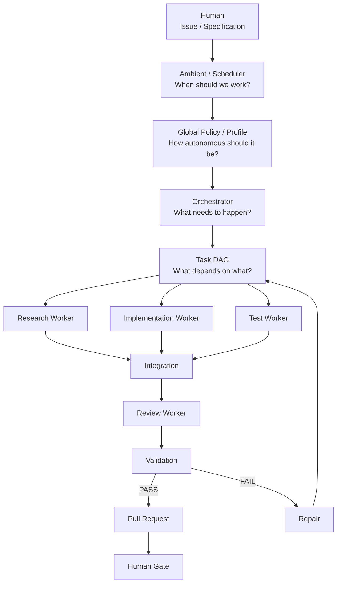

---

## 2. Global configuration and project configuration

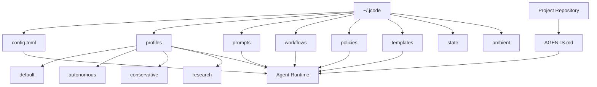

Configuration priority:

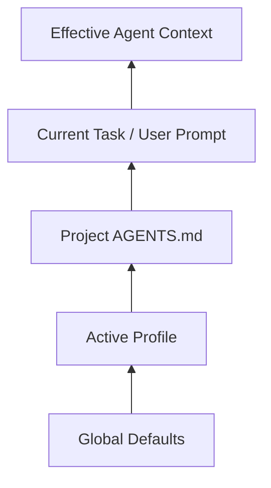

Safety is a special layer; ordinary project configuration cannot lower the safety level:

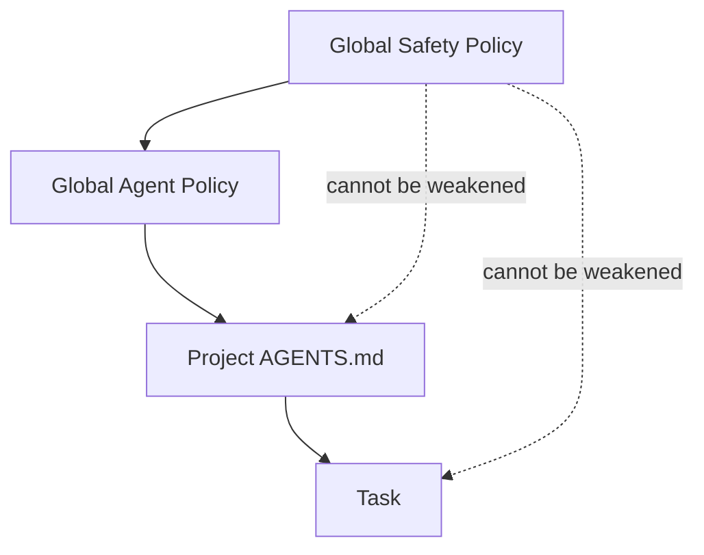

---

# 3. The `~/.jcode` directory

```mermaid
graph TD
    J["~/.jcode/"]

    J --> C["config.toml"]

    J --> P["profiles/"]
    P --> P1["default/"]
    P --> P2["autonomous/"]
    P --> P3["conservative/"]
    P --> P4["research/"]

    J --> PR["prompts/"]
    PR --> PR1["orchestrator.md"]
    PR --> PR2["worker.md"]
    PR --> PR3["reviewer.md"]
    PR --> PR4["tester.md"]

    J --> W["workflows/"]
    W --> W1["feature.md"]
    W --> W2["bugfix.md"]
    W --> W3["refactor.md"]
    W --> W4["research.md"]

    J --> PO["policies/"]
    PO --> PO1["autonomy.md"]
    PO --> PO2["git.md"]
    PO --> PO3["safety.md"]
    PO --> PO4["validation.md"]

    J --> T["templates/"]
    T --> T1["task.md"]
    T --> T2["handoff.md"]
    T --> T3["report.md"]

    J --> S["state/"]
    S --> S1["tasks/"]
    S --> S2["runs/"]
    S --> S3["logs/"]

    J --> AM["ambient/"]
    AM --> AM1["state.json"]
    AM --> AM2["queue.json"]
    AM --> AM3["usage.json"]
    AM --> AM4["logs/"]
```

---

# 4. Autonomous Coding Control Loop

This is the core state machine of the whole system:

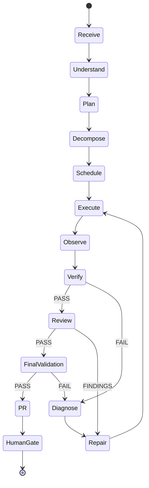

The most critical part is:

```text
FAIL
 ↓
Diagnose
 ↓
Repair
 ↓
Execute
 ↓
Verify
```

Rather than:

```text
FAIL → "try again"
```

---

# 5. Feature Workflow

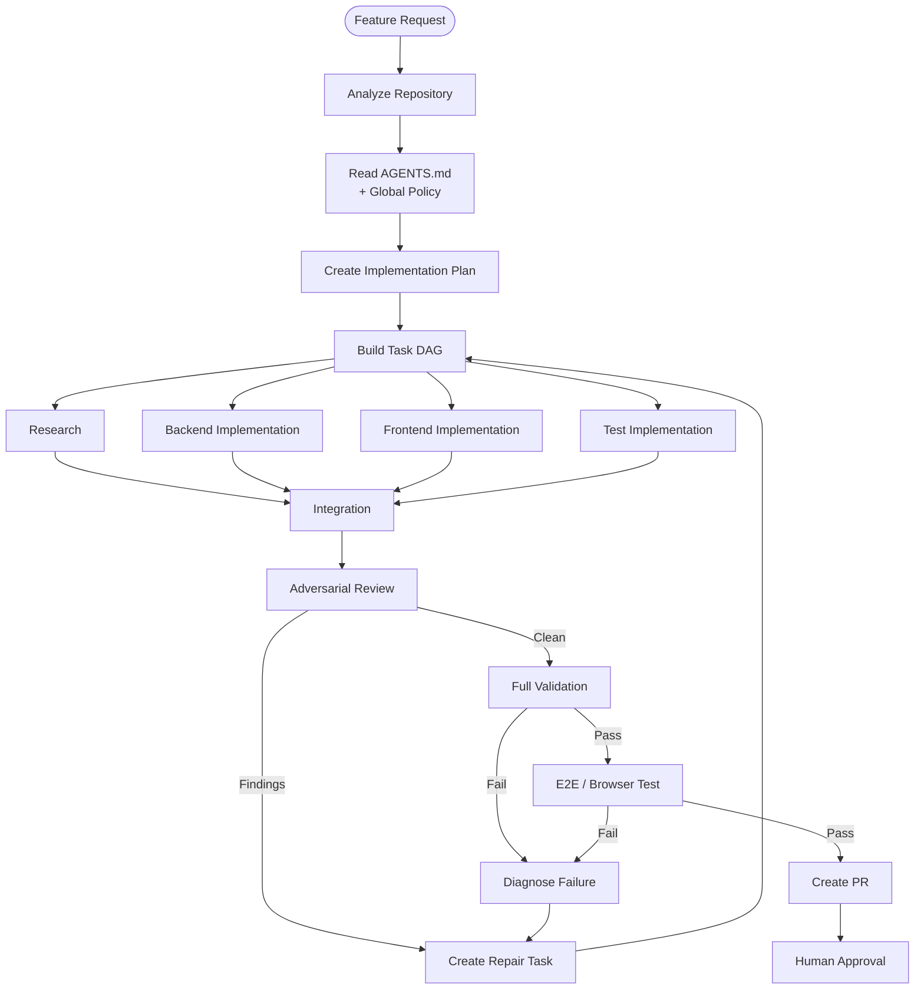

---

# 6. Swarm / DAG

The recommended DAG for a medium feature:

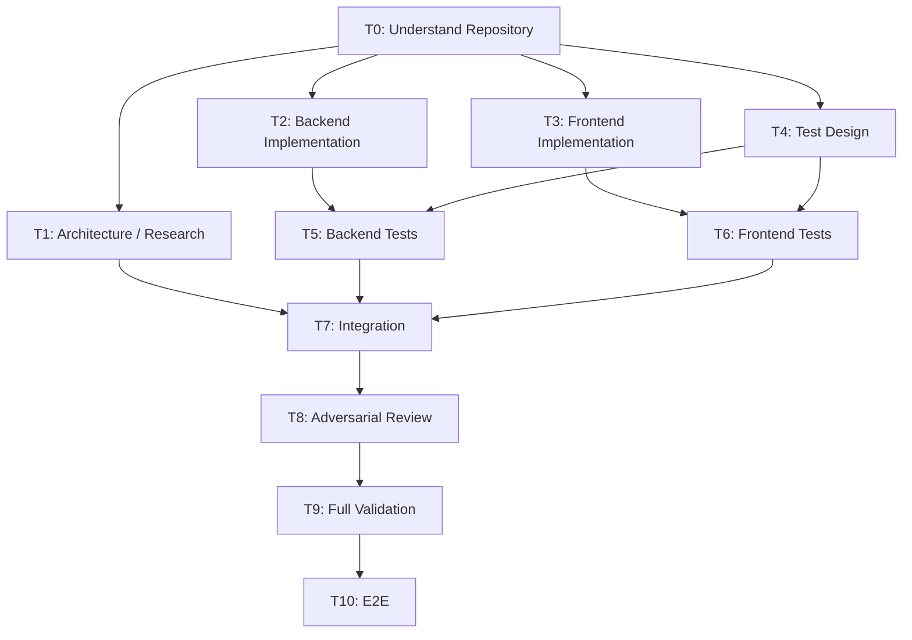

This is **not** "always exactly 6 agents".

The real logic is:

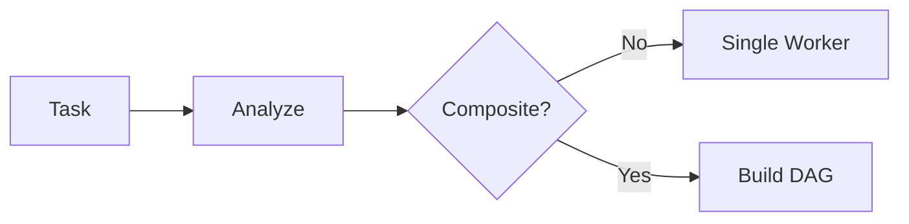

---

# 7. Workers and Handoff

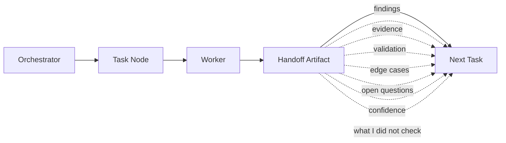

The recommended principle here:

> **DAG edges are the normal communication channel; agent-to-agent chat is the exception channel.**

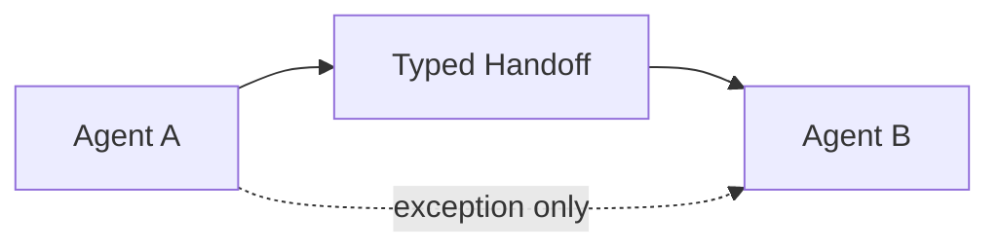

---

# 8. Git / Worktree

Default:

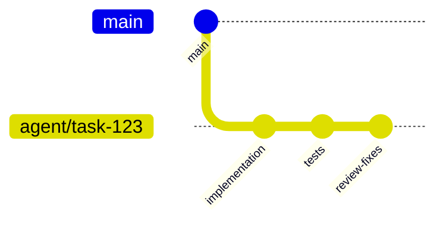

End state:

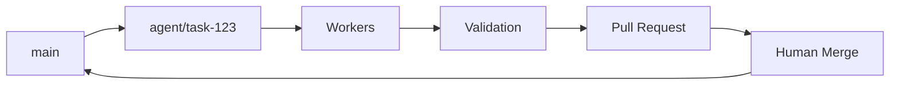

---

# 9. Worktree auto-strategy

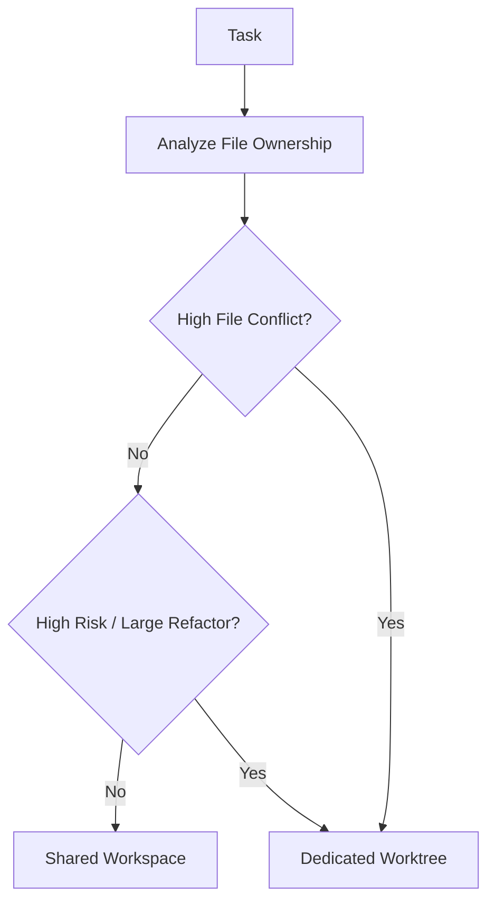

So:

```text
worktree ≠ agent

worktree = isolation boundary
```

---

# 10. Validation Pipeline

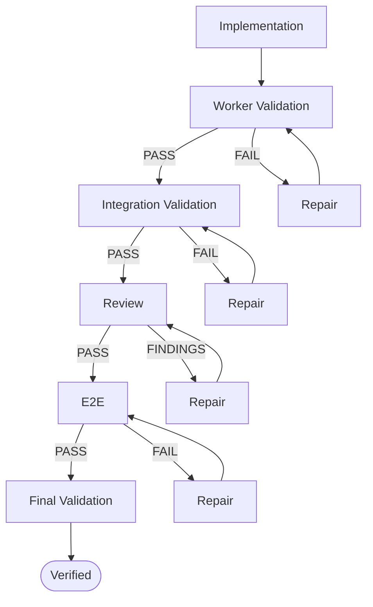

---

# 11. Review Gate

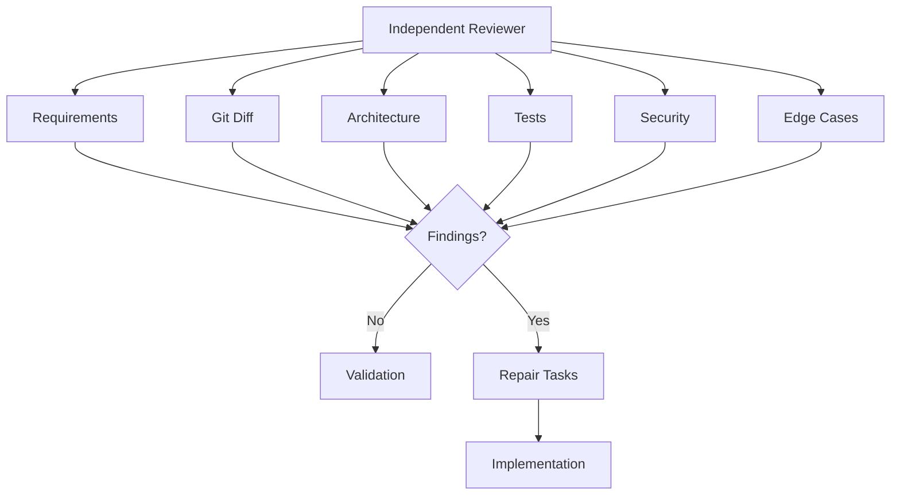

Reviewer principle:

```text
Coder != Reviewer
```

---

# 12. Repair Loop

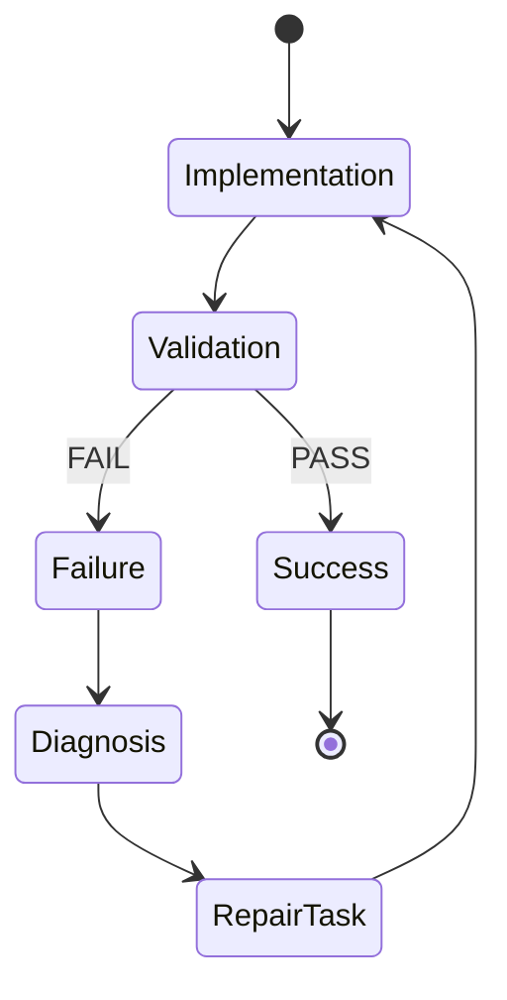

For stricter control, you can:

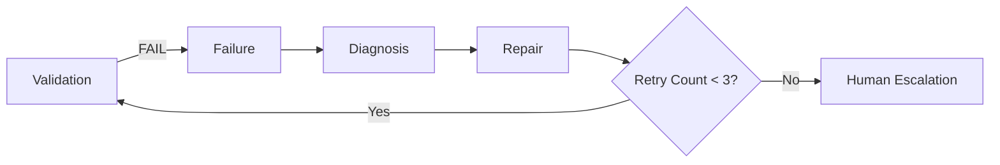

This prevents an agent from looping on repair indefinitely.

---

# 13. Safety Boundary

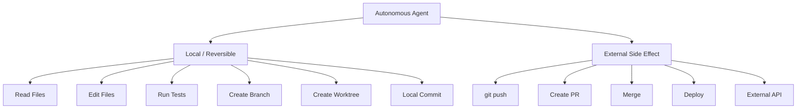

Recommendation:

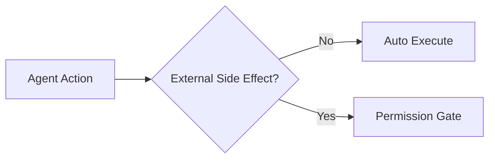

---

# 14. Ambient + Autonomous Coding

Adding the 24/7 mode:

```mermaid
flowchart TB
    Ambient[Ambient Scheduler]

    Queue[Task Queue]
    Orchestrator[Orchestrator]

    DAG[Task DAG]
    Workers[Worker Pool]
    Validation[Validation]
    PR[PR]

    Ambient --> Queue
    Queue --> Orchestrator
    Orchestrator --> DAG
    DAG --> Workers
    Workers --> Validation
    Validation --> PR
```

The four concepts, then:

```mermaid
flowchart LR
    Ambient["Ambient<br/>When?"]
    Orchestrator["Orchestrator<br/>What?"]
    DAG["DAG<br/>Dependencies?"]
    Worker["Workers<br/>How?"]

    Ambient --> Orchestrator
    Orchestrator --> DAG
    DAG --> Worker
```

I recommend keeping this layering.

---

# 15. Final six-layer architecture

One diagram to summarize the whole design:

```mermaid
flowchart TB
    subgraph L1["Layer 1 : Scheduling"]
        Ambient["Ambient / Scheduler<br/>When should we work?"]
    end

    subgraph L2["Layer 2 : Policy"]
        Global["Global Config / Profile"]
        Safety["Safety Policy"]
    end

    subgraph L3["Layer 3 : Intelligence"]
        Orch["Orchestrator<br/>What should happen?"]
    end

    subgraph L4["Layer 4 : State"]
        DAG["Task DAG<br/>Dependencies / Handoff"]
    end

    subgraph L5["Layer 5 : Execution"]
        Workers["Worker Pool"]
        Worktree["Git / Worktree"]
    end

    subgraph L6["Layer 6 : Trust"]
        Review["Review"]
        Test["Validation"]
        E2E["E2E"]
        Gate["Human Gate"]
    end

    Ambient --> Global
    Global --> Orch
    Safety --> Orch
    Orch --> DAG
    DAG --> Workers
    Workers --> Worktree
    Worktree --> Review
    Review --> Test
    Test --> E2E
    E2E --> Gate
```

### Mapping

| Layer | Core question | Components |
| - | ------------- | -------------------------------- |
| 1 | **When should we work?** | Ambient |
| 2 | **How are we allowed to work?** | Global Config / Profile / Safety |
| 3 | **What should we do?** | Orchestrator |
| 4 | **How do tasks relate?** | DAG |
| 5 | **Who actually executes?** | Workers / Git / Worktree |
| 6 | **How do we prove completion?** | Review / Test / E2E / Human |

The project's own `AGENTS.md` can be thought of as a **Repository Context Layer** spanning the middle tiers:

```mermaid
flowchart LR
    Global[Global jcode]
    Profile[Profile]
    AGENTS["Project AGENTS.md"]
    Task[Current Task]
    Runtime[Effective Runtime Context]

    Global --> Profile
    Profile --> AGENTS
    AGENTS --> Task
    Task --> Runtime
```

**This is the v1 architecture I recommend we lock in.**

When implementation begins, the most sensible next step is: **first define the 4 core schemas : `config.toml`, Task/DAG node, Handoff Artifact, Validation Result.** Once those four are fixed, the `orchestrator.md`, worker/reviewer prompts, workflows, and the Git/worktree controller can all be built around them without ending up as a tangle of cross-coupled prompts.