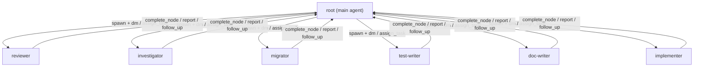
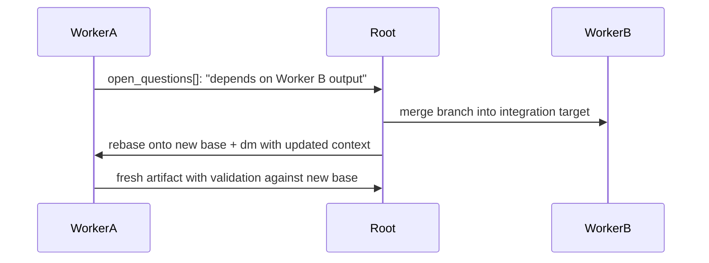

# Swarm Architecture (lazible-jcode)

This repo is a **prompt store + installer** for the lazible-jcode
overlay. It does not contain runtime code; everything is shipped as
markdown and symlinked into `~/.jcode/` by `scripts/install.sh`. This
file is the entry point for humans (or agents) trying to understand
the architecture in one read.

---

## Goals

1. **Main agent = organizer / planner / integrator.** Owns
   cross-worker state, integration branches, push, and end-to-end
   verification. Does not edit code in its own session; spawns
   implementers for any code work.
2. **Workers = concrete executors.** Each worker takes a tightly
   scoped task under one of the six roles and produces a typed
   artifact. Stateless from each other's perspective.
3. **Star topology with main at the hub.** The only edges are
   `worker <-> root`. No peer edges between workers. Cross-worker
   coordination flows rootward; root serializes dependencies and
   re-spawns.

---

## Topology

<!-- Diagram: star topology showing root at top, 6 workers below, and labeled communication edges -->


- 1 root per session, N workers spawned on demand
- Worker-to-worker communication: **forbidden** (Invariant #2)
- Worker-to-root: typed artifact (`complete_node`), status (`report`),
  help (`follow_up`)
- Root-to-worker: scope prompt at spawn, follow-up (`dm`), control
  (`stop` / `assign_task`)
- Workspace: root owns the main worktree; each worker owns a
  dedicated worktree at
  `$TMPDIR/swarm-$USER/<repo>-<short-sha>/wt-<label>/`

---

## Components

| File                                          | Loaded as                                       | Purpose                                              |
| --------------------------------------------- | ----------------------------------------------- | ---------------------------------------------------- |
| `swarm/prompt-overlay.md`                     | `~/.jcode/prompt-overlay.md` (default-on)       | Main-agent identity, invariants, decision flow       |
| `swarm/swarm-prompt.md`                       | `~/.jcode/swarm-prompt.md` (auto on spawn)      | Root + worker coordination policy, model routing     |
| `swarm/roles/<name>.md` (×6)                  | `~/.jcode/roles/<name>.md` (per spawn)          | Worker persona templates; main prepends on spawn     |
| `swarm/ARCHITECTURE.md` (this file)           | `~/.jcode/ARCHITECTURE.md`                      | Human-readable overview + goals                     |
| `scripts/install.sh`                          | run once                                        | Symlinks the above into `~/.jcode/`                 |
| `skills/<name>/SKILL.md`                      | `~/.jcode/skills/<name>/SKILL.md`               | Standalone skills; orthogonal to swarm but share symlink install path |
| `jcode-patches/swarm-coordinator-first.*`     | applied to upstream jcode at build              | Swaps the default main-agent identity to coordinator-first |

---

## Contracts (must hold)

### Invariants (overlay `### Invariants`)

1. One root per session — spawning never creates a second root.
2. No peer edges — inter-worker coordination flows rootward only.
3. Scope owns files — out-of-scope edits go to `open_questions[]`,
   not commits.
4. Typed artifact is a contract — missing fields = incomplete work
   regardless of compile / test status.
5. Root owns integration — only root merges worker branches.

### Worker output contract (each role, `## Output contract`)

Every worker completion must include:

- `findings` — short prose summary of what you concluded
- `evidence[]` — concrete citations (paths, hashes, lines, excerpts)
- `validation` — explicit gate results (`tsc: pass`, `jest: 23/23`,
  `curl /health: 200`, etc.)
- `open_questions[]` — gaps, out-of-scope observations, deferred calls
- `confidence: low | medium | high` — `high` requires a real check
- `what_i_did_not_check[]` — gates not run; empty only when
  exhaustive

Missing fields = incomplete work; root will reject and ask for redo.

### Cross-worker handoff (overlay `### Cross-worker handoff protocol`)

<!-- Diagram: 4-step sequence for cross-worker dependency resolution between Worker A, Root, and Worker B -->


When worker A's slice depends on worker B's output:

1. A reports the dependency in its artifact's `open_questions[]`
2. Root merges B's branch into the integration target
3. Root rebases A onto the new base and resumes A via `dm`
4. A re-reads via `git show <branch>:<file>` and emits a fresh
   artifact with `validation` against the new base

---

## Decision flow (root, before every task)

Run these three questions in order. Only proceed when the answers
converge.

1. **Independently verifiable on a worker slice?** If no — single
   trivial edit, a question, a single grep, an FYI update — do it
   solo and stop.
2. **≥ 2 files OR ≥ 2 unrelated areas?** If yes, spawn. If no and
   you can answer in one turn, stay solo.
3. **Ordering dependency on another in-flight worker?** If yes,
   serialize. Surface the gap, merge the dependency first, then
   re-spawn.

Two `spawn` answers + no dependency = spawn. Always pass `label`,
`model`, `effort`, worktree path, base SHA, and worker branch.

---

## Verification gates (each worker, before claiming done)

- Type check (`tsc --noEmit` or language equivalent)
- Linter (project's actual linter, not generic ESLint)
- Tests (run against changed files)
- Build (when changes touch build config, native deps, asset pipeline)

Report results verbatim in `validation`. "Looks good" is not
validation. If a gate cannot run, say so explicitly and downgrade
`confidence` accordingly.

For shared infrastructure changes (build, CI, deps), require
**end-to-end** verification — not just "tests pass on my slice".

---

## Path map (what lives where, after install)

```
~/.jcode/
├── prompt-overlay.md      <- swarm/prompt-overlay.md (default-on)
├── swarm-prompt.md        <- swarm/swarm-prompt.md (spawn-time)
├── ARCHITECTURE.md        <- swarm/ARCHITECTURE.md (this file)
├── AGENTS.md              <- ./AGENTS.md (project-level)
├── roles/
│   ├── reviewer.md
│   ├── investigator.md
│   ├── migrator.md
│   ├── test-writer.md
│   ├── doc-writer.md
│   └── implementer.md
└── skills/<name>/SKILL.md <- skills/<name>/SKILL.md
```

`scripts/install.sh` is the single source of truth for this layout.
It backs up existing files to `<dst>.bak.<timestamp>` before
overwriting.
